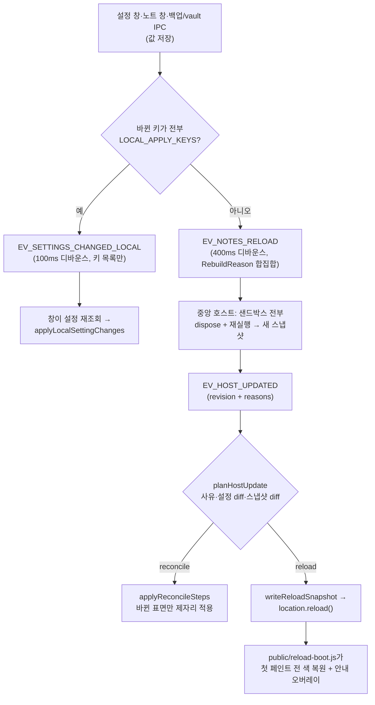

# 설정 변경이 창에 반영되는 경로

앱 전체 구조(창 구성·Rust 경계·플러그인 보안·데이터 레이아웃)는
[CONTRIBUTING.md의 「아키텍처」 절](../../CONTRIBUTING.md#아키텍처)에 있다. 이 문서는 그중
가장 얽힌 흐름 하나만 다룬다: **설정이나 플러그인 상태가 바뀌었을 때 이미 열려 있는 창이
그것을 어떻게 따라잡는가.**

이 흐름이 문서를 가질 만큼 복잡한 이유는 하나다. 예전에는 답이 하나였다 — 값이 하나라도
바뀌면 중앙 호스트가 플러그인을 전부 다시 실행하고, 열려 있는 노트 창이 전부
`location.reload()`했다. 창 열 개가 동시에 깜빡이고 스크롤·선택·IME 조합·플러그인 상태가
전부 날아갔다. 지금은 **바뀐 것이 무엇인지에 따라 세 갈래**로 나뉘며, 그 판정 규칙이 여러
모듈에 흩어져 있다.

## 세 갈래

| 갈래                | 언제                                                                     | 비용                                                   |
| ------------------- | ------------------------------------------------------------------------ | ------------------------------------------------------ |
| **국소 반영**       | 바뀐 설정 키가 전부 `LOCAL_APPLY_KEYS` 안 (색 오버라이드·글자 크기·글꼴) | 호스트 재빌드 없음. 창이 값만 다시 읽어 그 자리에 적용 |
| **재빌드 + 조정**   | 호스트를 거쳐야 해석되지만 재적용 API가 있는 표면만 바뀜                 | 샌드박스 전부 재실행. 창은 살아남고 바뀐 표면만 갱신   |
| **재빌드 + 리로드** | 그 밖 전부(모르면 리로드)                                                | 샌드박스 전부 재실행 + 창 `location.reload()`          |

## 전체 그림

## 1. 발신처 — 무엇이 어떤 사유로 재빌드를 부르는가

`EV_NOTES_RELOAD`는 `RebuildReason`의 **합집합**을 싣는다(디바운스 창 안에서 합쳐진 요청은
사유도 합쳐진다 — 하나라도 리로드가 필요한 사유였다면 그 사실이 방송에 남아야 한다).

| 발신 지점                                                   | 사유                                                       |
| ----------------------------------------------------------- | ---------------------------------------------------------- |
| 공유 설정 저장 (`bootstrap/settings.ts`)                    | `settings` — 단, `language`가 바뀌었으면 `locale`          |
| 플러그인 활성·부여·설치·제거 (`bootstrap/settings.ts`)      | `plugins`                                                  |
| 번들 플러그인 토글                                          | `plugins` — 단, 번들 **언어팩**이면 `locale`               |
| 플러그인 설정 값 1건 저장                                   | `plugin-setting`                                           |
| 언어 변경·언어팩 설치/토글/제거 (`flushNotesReload`)        | `locale`                                                   |
| 저장 폴더 변경 (`shared/tauri.ts`)                          | `vault`                                                    |
| 설정 초기화 · 전체 삭제 · 백업 복원                         | `reset` · `wipe` · `import`                                |
| 노트 툴바 스타일 최초 선택 (`note/toolbar-style-prompt.ts`) | `settings`                                                 |
| 사유가 없거나 형식이 다른 페이로드                          | `unknown` (`parseRebuildReasons`가 접는다 — 언제나 리로드) |

**언어 관련 경로를 새로 만들면 사유에 `locale`을 반드시 실어야 한다.** 언어팩은 중앙
호스트를 거치지 않아 스냅샷에도 공유 설정에도 흔적이 없다 — 사유가 유일한 근거이고, 빠뜨리면
열린 창이 옛 언어로 남는 무음 실패가 된다([`i18n.md`](i18n.md) 참고).

## 2. 판정 — 리로드인가 조정인가

정본은 `bootstrap/host-update-plan.ts`의 `planHostUpdate`다. 순서대로 본다.

1. **사유** — `locale`·`vault`·`reset`·`wipe`·`import`·`unknown`이 하나라도 있으면 즉시
   리로드. 사유가 아예 없어도 리로드.
2. **입력 가용성** — 재조회한 설정·스냅샷·vault 경로 중 하나라도 못 읽었으면 리로드
   (재조회는 10초 상한이고, 타임아웃도 "못 읽었다"다).
3. **화이트리스트 밖 변화** — vault 경로가 바뀌었거나, 바뀐 설정 키 중 하나라도
   `RECONCILE_SETTINGS_KEYS` 밖이거나(예: `toolbar_layout`), 플러그인이 추가·삭제됐는데 그
   슬라이스가 **아무 표면도 등록하지 않은 빈 껍데기**이거나(언어팩이 그 모양), `builtin`
   플래그가 뒤집혔으면 리로드.
4. **남으면 조정** — 실제로 달라진 것만 골라 `ReconcileStep` 목록을 만든다. 단계는 선언
   순서대로 적용된다:
   `theme` → `theme_overrides` → `background` → `font_size` → `font_family` →
   `window_controls` → `keymap` → `extensions` → `toolbar_items` → `youtubeEmbed` → `events`.

`events`는 **언제나** 들어간다: 재빌드는 모든 샌드박스를 다시 세우므로 구독 집합이 그대로여도
저쪽 인스턴스는 전부 새것이다. 그래서 이벤트 이미터를 갈아 끼우고 `note:opened`를 재발신한다
(플러그인 입장에서 "열린 적 없는 노트"가 되지 않게).

조정 도중 예외가 나면 반쯤 반영된 화면이므로 그 자리에서 리로드로 폴백한다.

## 3. 화이트리스트가 사는 곳

**전부 화이트리스트다** — "모르면 리로드"가 이 설계의 안전 원칙이고, 블랙리스트로 뒤집으면
새 키·새 표면이 하나 생길 때마다 조용히 가벼운 경로를 타고 **낡은 화면이 남는다**. 리로드는
깜빡이지만 언제나 옳은 화면을 낸다.

| 이름                                    | 위치                            | 무엇을 담는가                                                                    |
| --------------------------------------- | ------------------------------- | -------------------------------------------------------------------------------- |
| `LOCAL_APPLY_KEYS`                      | `bootstrap/settings-diff.ts`    | 호스트를 아예 거치지 않고 창이 값만 읽어 반영할 수 있는 설정 키                  |
| `APPLIERS`                              | `bootstrap/note-local-apply.ts` | 그 키를 실제로 적용하는 함수 맵 (키 집합이 위와 같아야 한다 — 테스트가 가드)     |
| `RECONCILE_SETTINGS_KEYS`               | `bootstrap/host-update-plan.ts` | 재빌드 뒤 제자리 조정으로 따라갈 수 있는 설정 키 (`LOCAL_APPLY_KEYS`의 상위집합) |
| `RELOAD_ONLY_REASONS`                   | `bootstrap/host-update-plan.ts` | 다른 입력을 볼 것도 없이 리로드인 재빌드 사유                                    |
| `ReconcileStep` + `applyReconcileSteps` | `bootstrap/host-update-plan.ts` | 조정 단계 어휘와 각 단계가 부르는 재적용 API                                     |
| `REBUILD_REASONS`                       | `plugin/host-protocol.ts`       | 아는 사유 전수(입력 검사의 정본)                                                 |

`LOCAL_APPLY_KEYS` ⊆ `RECONCILE_SETTINGS_KEYS`는 **의도된 포함 관계**다. 초과분(`theme`·
`keybindings`)은 "호스트 재빌드가 있어야 해석되는" 키라 국소 경로에 넣으면 안 된다 — 예를
들어 `theme`를 국소 화이트리스트에 넣으면 재빌드 방송 자체가 나가지 않아, 노트 창이 **옛
팔레트 위에 새 오버라이드만** 얹은 채 영원히 남는다.

## 4. 리로드가 남는 경우와 그 화면

리로드로 남는 것은 지금 이만큼이다: 언어·언어팩, `toolbar_layout`, vault 이동, 백업 복원,
설정 초기화·전체 삭제, 표면을 등록하지 않는 플러그인의 설치·삭제, 그리고 **사유 미상**.

리로드된 문서는 스타일시트만 적용된 채 한 번 그려지므로(기본 크림색) 그대로 두면
"빈 문서 → 크림색 → 진짜 색"으로 두 번 점프한다. 그래서 `bootstrap/reload-overlay.ts`가
`location.reload()` 직전에 테마 인라인 토큰·배경색·글자색·접힘 여부와 번역된 안내 문구를
`sessionStorage`에 적고, 번들 밖의 동기 클래식 스크립트 `public/reload-boot.js`가 첫 페인트
전에 그것을 읽어 색을 복원하고 「설정 적용 중…」 오버레이를 띄운다(200ms 지연 페이드인이라
빠른 리로드에서는 배경색만 유지되고 문구는 보이지 않는다). 마운트가 끝나면 성공·실패 모두
오버레이를 걷고, 10초 안전 타이머가 이중으로 보호한다.

> 부트 스크립트가 번들 밖 `public/`에 있는 이유: CSP `script-src 'self'`가 인라인 스크립트를
> 막고, `public/`은 Vite가 변환 없이 `dist`로 복사한다. `sessionStorage` 키·필드 이름·오버레이
> id가 두 파일에서 **정확히** 일치해야 한다.

## 5. 체크리스트 — 새 설정 키나 새 표면을 더할 때

기본값은 **아무것도 안 하는 것**이다. 새 키는 자동으로 화이트리스트 밖이라 리로드로
떨어지고, 그것이 안전한 상태다. 가볍게 만들고 싶을 때만 아래를 밟는다.

**새 공유 설정 키를 국소 반영시키려면**

1. `bootstrap/settings-diff.ts`의 `LOCAL_APPLY_KEYS`에 키를 더한다(점 표기 — `defaults.*`는
   서브키 단위로 쪼개진다).
2. `bootstrap/note-local-apply.ts`의 `APPLIERS`에 같은 키의 적용기를 더한다. 두 집합이 어긋나면
   통지가 조용히 버려지거나 반쯤 반영된다(드리프트 가드 테스트가 잡는다).
3. **다른 창도 이 값을 읽는가**를 확인한다. 노트 창 말고 패널·설정 창이 소비한다면 그쪽도
   `EV_SETTINGS_CHANGED_LOCAL`을 구독해야 한다(`bootstrap/panel.ts`가 색 오버라이드에 대해
   그렇게 한다). 아니면 국소 경로에 넣지 마라.
4. 마운트 시점의 해석과 국소 반영의 해석이 **같은 함수**를 쓰는지 확인한다 — 갈리면 "새로 연
   창과 열려 있던 창의 값이 다르다"가 된다.

**재빌드가 필요하지만 리로드는 피하고 싶으면**

1. 그 표면에 **재적용 API**를 만든다(`NoteWindowHandle.apply*` / `reconcile*`). 마운트 경로와
   같은 해석을 공유해야 한다.
2. `ReconcileStep`에 단계를 더하고, `applyReconcileSteps`에 배선한다.
3. `planHostUpdate`에 그 표면의 **변화 판정**을 넣는다(설정 키면 `RECONCILE_SETTINGS_KEYS`,
   스냅샷 필드면 diff 비교).
4. 새 사유가 필요하면 `plugin/host-protocol.ts`의 `RebuildReason`·`REBUILD_REASONS`에 더하고,
   발신 지점이 그 사유를 싣게 한다. **판정기 화이트리스트에 넣기 전까지는 리로드가 기본값**이다.
5. 조정 경로만 있고 스냅샷이 늦게 도착하는 경우(`planLateSnapshot`)도 함께 볼지 판단한다 —
   마운트 낙관값이 있는 표면(테마·배경·폰트·창 컨트롤)이 대상이다.
6. 테스트: `src/bootstrap/host-update-plan.test.ts`가 판정을, `src/note/note-window.test.ts`가
   적용을 고정한다. "조정되어야 하는데 리로드로 떨어진다"보다 **"리로드되어야 하는데 조정으로
   샌다"가 위험한 실패**이므로 후자를 먼저 가드하라.

## 시작 가이드 메모

첫 실행에 한 장 자동으로 만들어지는 체험형 체크리스트 메모(`src/note/guide-note.ts` — 본문
조립, `src/bootstrap/guide-note.ts` — 만들기·소환 배선)다. "정확히 한 장"을 지키는 원자성은
코어(`commands::claim_guide_note`)가 쥔다: (1) 공유 설정 잠금만 쥐고 `notes::new_note_id`로
id를 발급해 `SharedSettings.guide_note_id`에 먼저 예약하고, (2) 그 잠금을 놓은 뒤 vault
잠금만 쥐고 그 id로 실제 노트를 만든다. 두 잠금을 겹쳐 쥐지 않는 이 코드베이스의 규칙
(`window_manager::read_note_view`와 같은 결) 때문에 id를 vault 밖에서 미리 발급해야 하는
것이 2단계로 나뉜 이유다. 2단계(노트 생성)가 실패하면 1단계의 예약을 되돌린다 — 안 그러면
"만들었다고 기록됐지만 노트는 없는" 상태로 굳어 가이드가 영영 뜨지 않는다.

`guide_note_id`는 **코어 소유 필드**다: 프론트가 보내는 `save_shared_settings`는 이 값을
바꾸지 못하고, `commit_shared_settings`가 `next`에 무엇이 담겨 있든 지금 값으로 되돌린다
(`src-tauri/src/commands.rs`). 설정은 부분 갱신이 아니라 한 벌 통째로 저장하는 형식이라, 이
보호가 없으면 가이드가 만들어지기 **전에** 설정을 읽어 둔 창이 나중에 저장할 때 그 옛
스냅샷이 방금 기록된 id를 지워 다음 실행에 가이드가 하나 더 생긴다. 지금 이 규칙의 유일한
적용 대상이지만, **새 코어 소유 필드를 추가할 때** 참고할 자리가 여기다 — `commit_shared_settings`에
같은 되돌리기 한 줄을 더하고 이 절에 적어 둔다.

생성 시도는 **패널과 설정 창의 부트스트랩에서만** 한다(둘 다 마운트가 끝난 뒤 곁다리로,
실패해도 그 창은 이미 떠 있다). 노트 창은 부르지 않는다 — 노트 창은 사용자가 지금
**타이핑하는** 표면이라 가이드 창을 그 위에 띄우면 포커스를 뺏는다. 시작 흐름이
자동시작·점프리스트가 아닌 한 패널을 항상 여므로(`lib.rs`의 `startup_plan` D1) 진짜 첫
실행은 패널이 반드시 만든다.

**미해결**: 첫 실행 환영 노트(Rust 내장, `src-tauri/src/state.rs`, ko/en 두 벌 고정)와 이
가이드 메모는 "처음 켠 사용자에게 보여 줄 것"이라는 역할이 겹친다. 환영 노트는 창이 하나도
없는 부팅 시점에 Rust가 만들어야 해서 언어팩이 닿지 못하고, 가이드는 창이 뜬 뒤 프론트가
만들어 언어팩이 번역할 수 있다 — 이 차이 때문에 둘을 아직 하나로 합치지 않았다.
